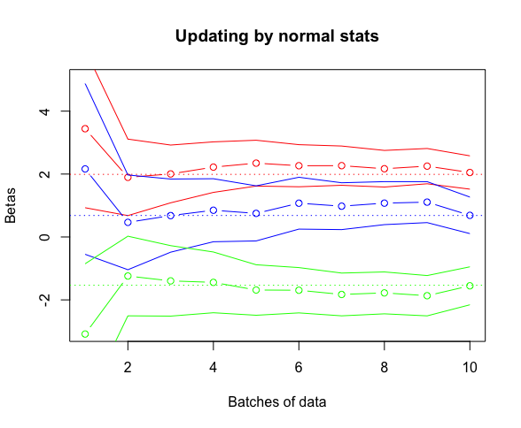
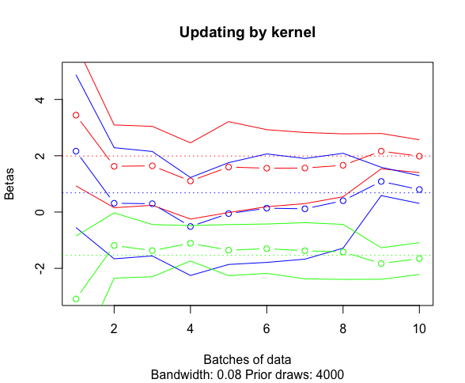
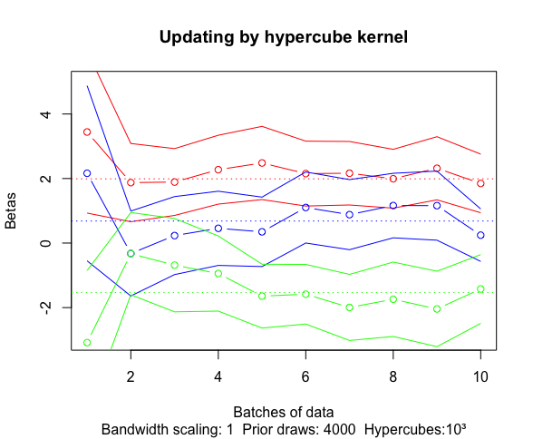
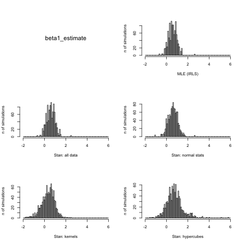

# non-parametric-bayes-updating
Non-parametric kernel methods for updating a Bayesian model's parameters with new batches of data

©BayesCamp Ltd, CC-BY-NC-SA

## Abstract

One of the big attractions for people adopting Bayesian methods is the promise of "updating" their parameter estimates and predictions as more data arrive. Yesterday's posterior becomes today's prior. In practice, this is not always simple, requiring at the very least a complete set of sufficient statistics, random samples for an unchanging population, and no changes of probability distribution for the priors. Sometimes, one would like to update without imposing an a priori distribution on yesterday's posterior and without estimating lots of statistics. I discuss a kernel approach, which is easily incorporated in Stan by an additional target+= statement with uniform proposal densities. I compare this with parametric updates, and explore the potential to reduce computation by using kernels weighted by counts of posterior draws inside hypercubes of parameter space.

## Simulated data

As a proof of concept, I generated random data with two correlated normally distributed predictor variables (x1 and x2), and a Bernoulli dependent variable (y). So, there are three parameters in a logistic regression: beta0, beta1 and beta2. The true relationship in the population is y = 2 + (0.5)x1 - (1.5)x2. There are 200 observations, split into ten equally-sized batches for updating. For each dataset like this, we calculate MLEs and standard errors using frequentist (iteratively reweighted least squares) logistic regression, and complete-data posteriors by running a logistic regression model in Stan on all 200 observations. Our goal is to test whether updating by parametric statistics, or by kernel densities on a sample from the previous posterior, or by counts of posterior draws within hypercubes of parameter space, can approximate those values.

This simulated analysis was repeated 1000 times. The first batch is analysed with very diffuse normal priors on the betas. Then, the results of this are used to start the updating.

## Updating methods

The parametric update approach involves obtaining the vector of sample means and matrix of sample variances and covariances from the posterior, and supplying that as arguments for a multivariate normal prior in the analysis of the next batch. This produces successive results that settle very close to the results from analysing all the data together, and the 95% credible intervals visibly narrow as the data are added.

*Figure 1: posterior means and 95% credible intervals for the three parameters in one simulated dataset, as they update over ten batches of data. Horizontal dotted lines show the true population values.*

The non-parametric update approach involves having default uniform priors inside Stan, which are actually proposal densities. Betas are drawn from those, then the log-likelihood is accumulated over the data as normal. Finally, we loop over the draws from the previous posterior, and in each draw loop over the parameters to accumulate a multivariate density around each draw, add these together and divide it by the number of draws before adding the log-prior to the log-likelihood, using target+= in Stan. In this way we obtain P(x|θ)P(θ).

*Figure 2: Updating using Gaussian kernels on 4000 draws from the previous posterior, with bandwidth 0.08.*

Using 4000 posterior draws gave results broadly consistent with the parametric updates, while 400 draws was notably inferior in accuracy and efficiency. The choice of kernel bandwidth also has a notable impact. At present, it has to be chosen manually by comparing an anticipated normal distribution with a kernel density of draws from that normal distribution. Too small a bandwidth introduces noise (and sudden changes in prior density gradient may slow down Stan), while too large a bandwidth will inflate the variance. Stan's common stepsize for all parameters necessitates a model specification scaled in such a way that a common bandwidth is also likely to suffice.

It seems to me that there are three options for the kernel approach:
1.	for all draws, evaluate densities that are defined on the whole of the parameter space (for example, multivariate Gaussians); calculate the mean of these
2.	for only those draws that lie within a given distance of the current proposed parameter vector, evaluate densities that are defined within that distance, and that asymptotically reach zero at the boundaries (for example, transformed multivariate betas); add these and divide by the total number of draws in the prior, not just those that were evaluated (the others having had zero density)
3.	count prior draws within hypercubes of the parameter space, use either (1) or (2) above on the hypercube centroids; calculate a weighted average using the counts in each hypercube (note that the size of the grid has to adapt as the posterior is updated and shrinks)

(3) appears to be most efficient, but at anything more than a few parameters, the dimensionality of the parameter space will require too many hypercubes for it to be efficient compared to (1) or (2), although I have not explored sparse indexing to evaluate only the hypercubes of interest at each update.

*Figure 3: Updating using Gaussian kernels on hypercube centroids, weighted by the count of draws in ten bins for each parameter. Bandwidth is proportionate to the median range of posterior draws in each dimension, at each update.*

I ran this simulation 1000 times on four instances of R and RStan, using the same settings as above for the parametric, kernel and hypercube updating, with 4 chains in parallel, 5000 iterations per chain, discarding 4x2500 as warmup and sampling 4x1000 for kernels. This ran on a 16-core Linux virtual machine (DigitalOcean). All code is available via [bayescamp.com/research](https://www.bayescamp.com/research.html)

*1000 posterior mean estimates of the beta1 parameter. Other parameters had similar patterns.*

*1000 posterior standard deviation estimates of the beta1 parameter. Other parameters had similar patterns.*

Stan code can be found in the .R script files. **non-para-kernel-updating.R** runs one simulation, **non-para-kernel-updating-sims.R** does many, and was run in separate instances (with amended RNG seeds) in the cloud, before being recombined with **recombine-simulations.R**.

## Conclusions

Kernel updating is a potentially useful trick when we need to scale up a serious Bayesian analysis to large datasets and run it regularly, as is often the case in commercial data science settings. It requires care when setting the bandwidth and size of the posterior sample. It does not seem to have been done before; the only similar work I found was by Clayton Deutsch at the University of Alberta (see the paper "Data Integration with Non-Parametric Bayesian Updating"), although he didn't directly use posterior draws.

As an aside, although I call this a kernel method after the established kernel density technique, in the code I have written, I evaluate proper probability densities for the prior, which is fast in Stan and makes the calculation simpler. In theory, you could use kernel functions and rescale them afterwards, but I don't see an advantage to it.

There are two interesting avenues to take this approach further. Firstly, a similar approach can be adopted with a Gibbs sampler. Users of BUGS and JAGS have long been familiar with the "ones trick" and the "zeros trick" to increase the log likelihood arbitrarily (and Section 9.5.2 of The BUGS Book applies this to prior distributions with a uniform proposal density). This might allow us to iterate between evaluating discrete parameters in BUGS/JAGS and highly correlated continuous parameters in Stan. Secondly, Bayesian neural networks might benefit from a method to pass strangely-distributed posterior predictions forward from one layer to the next (or backward).
